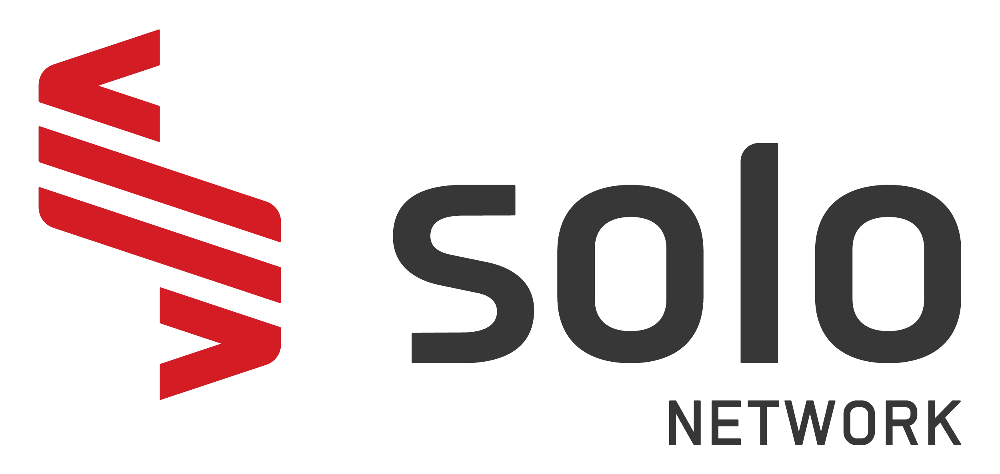

# Modelo inicial para Terraform no Azure - Solo Network

Este é um modelo inicial destinado a ajudar a começar com novos projetos do Terraform no Azure.

Além disso, o repositório inclui um [dev container](https://code.visualstudio.com/docs/remote/containers) destinado ao uso com [VS Code](https://code.visualstudio.com/) e [Visual Studio CodeSpaces](https://visualstudio.microsoft.com/services/visual-studio-codespaces/).

## Gerando o dev container

1. No VS Code, execute `CTRL+SHIFT+P -> Remote-Containers: Add Development Container Configuration Files...`.

2. Clique em "Show All Definitions..." se necessário e selecione "Devcontainer Terraform".